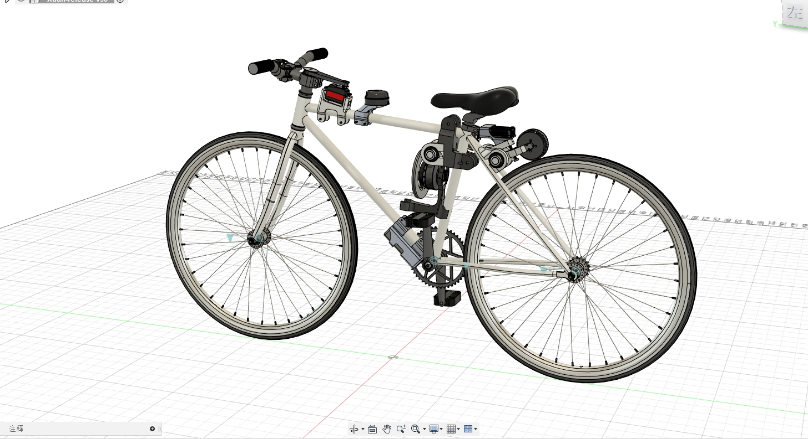
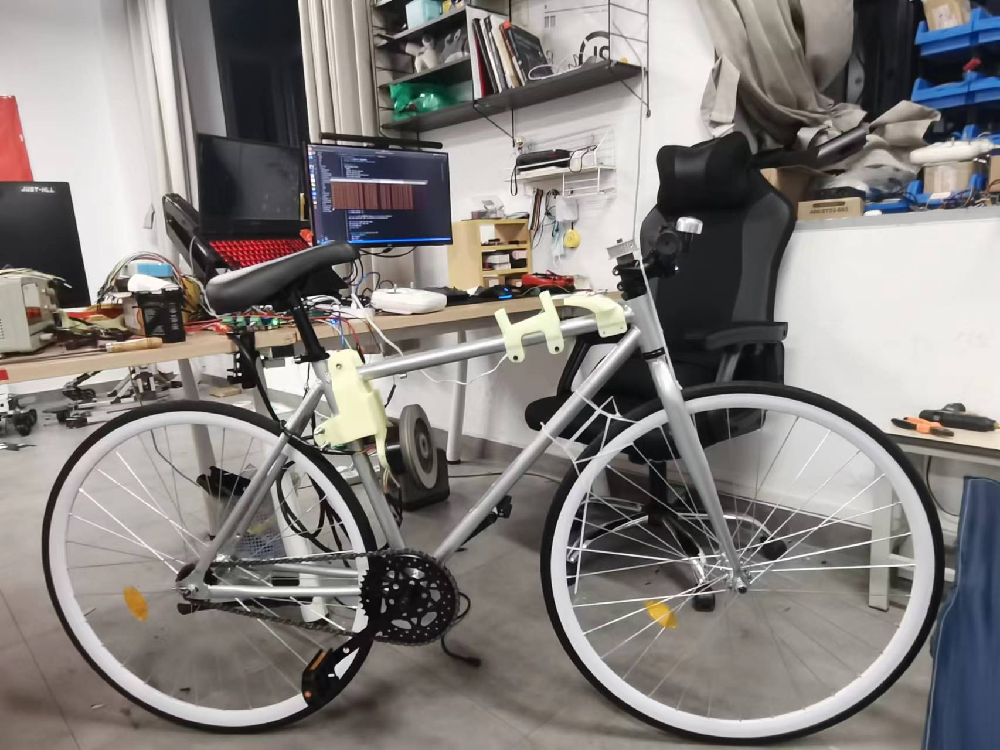
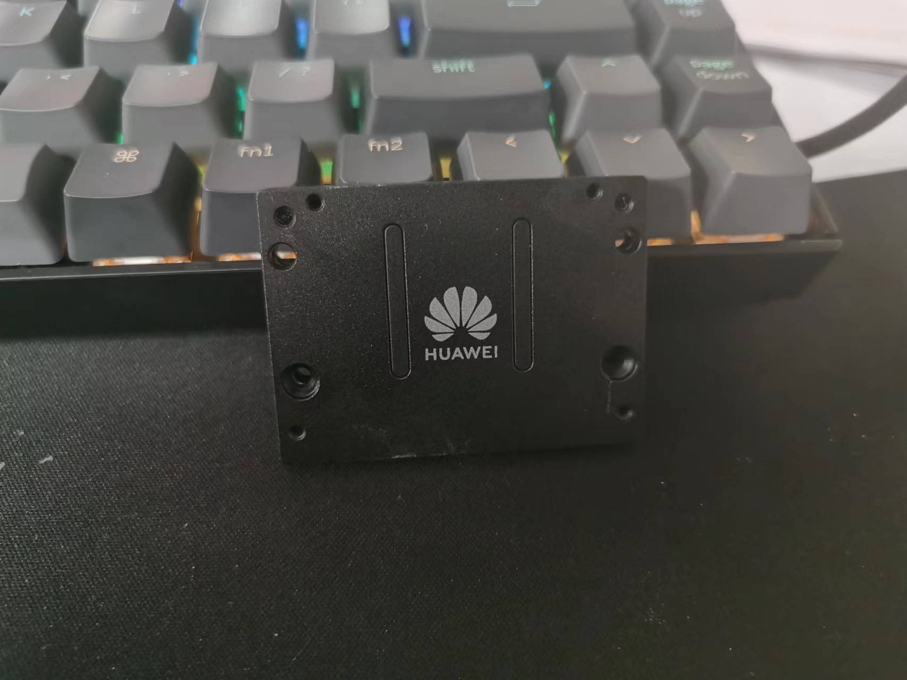

# Bike-XUAN
> Author: weihaoysgs@gmail.com

<center></center>


<center></center>


$\quad$ 整个项目主要复现了稚挥君 `XUAN` 自行车，但具体的技术方案上存在一定的差别，机械结构上对动量轮的支撑机构进行了小小的改进，去掉了原先可以活动的结构。电机控制上则使用的是现成的 `odrive`。在整个控制程序中是基于 `ROS` 这一通信中间件，结合 `CAN` 总线进行的数据交互，没有使用单独的单片机去做电机驱动。控制算法使用的是经典 `PID` 控制。同时值得一提的是在 `AI` 处理模块中使用的则是和稚挥君同款的华为升腾 `Atlas 200 DK` 处理芯片，该芯片由全国大学生智能汽车竞赛航天组主办方，中国航天科工第三研究院赞助。

<center></center>


## 1.0 硬件选型

<center></center>

|           名称           |          型号           |
| :----------------------: | :---------------------: |
|           电池           | `DJI Roomaster 6S `电池 |
|          处理器          |       `Intel NUC`       |
| 动量轮电机、后轮驱动电机 |      `X8018` 电机       |
|          `IMU`           |       `IMU-CH100`       |
|       无刷电机驱动       |        `odrive`         |
|           舵机           |     `60KG` 串口舵机     |
|          摄像头          |        `Astra S`        |
|      部分机械结构件      |  树脂打印或者金属加工   |
|          自行车          |          死飞           |
|          遥控器          | `DJI Robomaster`遥控器  |


## 2.0 核心控制节点介绍

- `can_send_receive_node`

  该节点主要负责定时发送 `CAN` 命令到 `Odrive` 使得 `Odrive` 可以回传点击的速度和位置信息到 `NUC`。进而将接收到的数据解析后发布到 `ROS` 中去。

- `parser_remote_data` 

  该节点负责接收 `DJI` 遥控器串口数据，并进行解析发布到 `ROS` 中去。

- `bike_xuan_control_node`

  该节点则为整个系统的核心节点，运行整体的控制算法，并通过 `CAN` 总线将控制信息发送给 `Odrive` 实现平衡。

## 3.0 快速开始

- 启动 `IMU`

```shell
roslaunch imu_launch imu_msg.launch
```

- 启动遥控器解析节点

```shell
rosrun bike_core parser_remote_data_node
```

- 启动 `CAN` 消息发送节点

```shell
 rosrun bike_core can_send_receive_node
```

- 启动核心控制节点

```shell
 rosrun bike_core bike_xuan_core_control_node
```

## 4.0 参数调试

$\quad$ 该项目中对自行车的姿态控制算法中使用的是三环 `PID` 控制算法，从外到内依次是速度环、角度环、角速度环没，调试顺序根据有内而外的原则进行调试，本项目中初次平衡的 `PID` 参数如下所示，通过将其写在 `YAML` 文件中，更改即可方便改变参数。

```yaml
%YAML:1.0
---
Pid.Name: bike_angle_pid
Kp: 5.213
Ki: 0.015
Kd: -0.15
CalculateTime: 90
Debug: 0
Integal.Limit: 1.0
Use.Integal.Limit: 1
Output.Limit: 10.0
Use.Output.Limit: 1
```

```yaml
%YAML:1.0
---
Pid.Name: bike_angle_velocity_pid
Kp: 410.0
Ki: 0.21
Kd: -92.1
CalculateTime: 30
Debug: 0
Integal.Limit: 200.0
Use.Integal.Limit: 1
Output.Limit: 2000.0
Use.Output.Limit: 1
```

```yaml
%YAML:1.0
---
Pid.Name: bike_speed_pid
Kp: -0.001
Ki: 0.000
Kd: -0.000
CalculateTime: 480
Debug: 0
Integal.Limit: 2.0
Use.Integal.Limit: true
Output.Limit: 6.0
Use.Output.Limit: true
```

