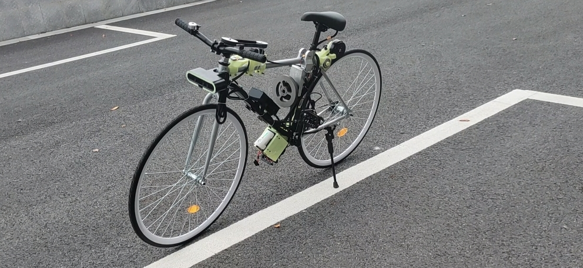

# Bike-XUAN-HLL

<div align="center">

[English](README.md) | [简体中文](doc/README_CN.md)

</div>

<div align=center>

</div>

$\quad$ The entire project mainly reproduces Zhi Huijun's `XUAN` bicycle,Unfortunately, Mr. Zhihui only opened up the mechanical structure and did not open up his own control program implementation, there are certain differences in the specific technical solutions. The mechanical structure has made small improvements to the support mechanism of the momentum wheel, and the original movable structure has been removed. For motor control, `odrive` is used. The entire control program is based on the `ROS` communication middleware, combined with the `CAN` bus for direct data interaction with the NUC, without using a separate microcontroller to drive the motor. The control algorithm uses the classic three-loop `PID` control. It also has a simple obstacle avoidance system based on vision, and the final overall operating effect is as follows.

<table>
    <tr>
        <td><center></center></td>
        <td><center></center></td>
    </tr>
    <tr>
        <td><center>avoid obstacle</center></td>
        <td><center>go straight</center></td>
    </tr>
</table>


$\quad$ At the same time, it is worth mentioning that the `AI` processing module uses the same Huawei Ascend `Atlas 200 DK` processing chip as Zhi Huijun. Sponsored by the Third Research Institute of the Industrial Group.

<div align=center>

</div>


## 1. Main hardware selection

<center>

|           Sensor           |          Type           |
| :----------------------: | :---------------------: |
|           battery           | `DJI Roomaster 6S `battery |
|          processor unit   |       `Intel NUC`       |
| Momentum and rearwheel motor |      `X8018` motor       |
|          `IMU`           |       `IMU-CH100`       |
| Brushless motor drive |        `odrive`         |
|           servo        |     `60KG` Serial servo     |
|          Camera          |        `Astra S`        |
|      Some mechanical structural parts      |  Resin printing or metal processing   |
|          bike          |          fixed gear           |
|          remote control          | `DJI Robomaster` remote control  |

</center>


## 2. Introduction to core control nodes

- `can_send_receive_node`

  This node is mainly responsible for regularly sending `CAN` commands to `Odrive` so that `Odrive` can return the click speed and position information to `NUC`. Then the received data is parsed and published to `ROS`.

- `parser_remote_data` 

  This node is responsible for receiving `DJI` remote control serial port data, parsing and publishing it to `ROS`.

- `bike_xuan_control_node`

  This node is the core node of the entire system, runs the overall control algorithm, and sends control information to `Odrive` through the `CAN` bus to achieve balance.

## 3. Quick start

- Launch `IMU`

```shell
roslaunch imu_launch imu_msg.launch
```

- Start the remote control parsing node

```shell
rosrun bike_core parser_remote_data_node
```

- Start the `CAN` message sending node

```shell
 rosrun bike_core can_send_receive_node
```

- Start the core control node

```shell
 rosrun bike_core bike_xuan_core_control_node
```

## 4. Parameter debugging quick

$\quad$ The bicycle attitude control algorithm used in this project is a three-loop `PID` control algorithm. From outside to inside, there are speed loop, angle loop and angular velocity loop. The debugging sequence is based on the inside-out principle. This paper The `PID` parameters for the initial balancing in the project are as follows. By writing them in the `YAML` file, you can easily change the parameters.

```yaml
%YAML:1.0
---
Pid.Name: bike_angle_pid
Kp: 5.213
Ki: 0.015
Kd: -0.15
CalculateTime: 90
Debug: 0
Integal.Limit: 1.0
Use.Integal.Limit: 1
Output.Limit: 10.0
Use.Output.Limit: 1
```

```yaml
%YAML:1.0
---
Pid.Name: bike_angle_velocity_pid
Kp: 420.0
Ki: 0.21
Kd: -92.1
CalculateTime: 30
Debug: 0
Integal.Limit: 200.0
Use.Integal.Limit: 1
Output.Limit: 2000.0
Use.Output.Limit: 1
```

```yaml
%YAML:1.0
---
Pid.Name: bike_speed_pid
Kp: -0.001
Ki: 0.000
Kd: -0.000
CalculateTime: 480
Debug: 0
Integal.Limit: 2.0
Use.Integal.Limit: true
Output.Limit: 6.0
Use.Output.Limit: true
```

## Reference
- [peng-zhihui-XUAN](https://github.com/peng-zhihui/XUAN)
- [ODrive](https://github.com/odriverobotics/ODrive)
- [Ascend-projects](https://gitee.com/organizations/ascend/projects)

## Contact me

If you have any technical questions, please contact me in time.

- Email: weihaoysgs@gmail.com <br>
- Blog: www.weihaoysgs.com
